# PHPer のための<br>Cloudflare 実戦入門
### Cloudflareで PHP を動かしてみよう

<!--
掴み: 「今日の発表のゴールは、皆さんの PHP アプリの新しいデプロイ先を1つ増やすことです」
Cloudflare というキーワードで会場の反応を見る。
ここで時間を使いすぎないこと。ひと呼吸で次へ。
-->

---


## 自己紹介

### スー

- **所属**: MOSH 株式会社
- **やってること**
  - LaravelLiveJapan Core Staff
  - Go-to-Market エンジニア
  - 技術広報
- **趣味**: お酒 / サウナ / アニメ / マンガ

### よろしくお願いします 🍻

<!--
自己紹介は 30-40秒。
LaravelLiveJapan Core Staff という肩書は PHPer 会場なら刺さる。
「Go-to-Market エンジニア」は珍しいので一言添えてもよい。
趣味は参加者とのアイスブレイクに使える（懇親会のフック）。
-->

---

## 今日のゴール

1. **Cloudflare で PHP が動く 3つのアプローチ**を理解する
2. どれを選ぶかの **判断軸**を持ち帰る
3. 帰ったらすぐ **`wrangler deploy`** を試したくなる

### 本日のサンプル
- GitHub: `github.com/SuguruOoki/cloudflare-php-demo`
- Live: `cloudflare-php-container-demo.suguru-ohki.workers.dev`

<!--
「今日のゴール」を先に見せることで聴衆に「持ち帰り」を意識させる。
ここで「すぐ試したくなる」と宣言することで、デモ回のコミットを作る。
サンプルURLを先に出すと、興味ある人は手元で触りながら聞ける。
-->

---

## 質問: Cloudflare Workers、使ってますか？

<br>

### よく聞く声
- ✋ 「TypeScript/Node.js のエッジ関数を動かす基盤でしょ？」
- ✋ 「CDN と DNS は知ってる」
- ✋ 「そもそも触ったことない」

<br>

### 今日話したいのは
> **「PHP を Cloudflare で動かす」**という選択肢

<!--
会場に問いかけて挙手を取る（オンラインならチャットで）。
多くの PHPer は Workers = JS/TS の印象。
「PHP で動く」という不協和音を作り、次のスライドへ引き込む。
-->

---

## そもそも Cloudflare って何ができる？（30秒）

- **Workers**: エッジ（330+都市）で動く関数基盤
- **Containers**: 2025年 GA。Worker から OCI イメージを起動
- **D1**: SQLite 互換のエッジ DB
- **R2**: S3 互換オブジェクトストレージ（egress 無料）
- **KV / Queues / Durable Objects**: キャッシュ・キュー・状態管理

→ **「PHP のために必要な部品は全部揃っている」**

<!--
PHPer に馴染みのあるキーワード（DB, オブジェクトストレージ）に寄せて説明。
「部品は揃っている」というフレーズで「じゃあ後はどう組むか」への期待を作る。
R2 の egress 無料は地味にコスト面で大きいので強調する。
-->

---

## なぜ今、PHPer が Cloudflare を気にすべきか

| 観点 | 従来 VPS/EC2 | Cloudflare |
|---|---|---|
| **レイテンシ** | リージョン1拠点 | ユーザー直近の拠点（日本で TTFB 10ms 台） |
| **コスト** | 24h 稼働で固定 | 従量 + 大きな無料枠 |
| **スケール** | 突発流入で落ちる | 自動スケール |
| **運用** | OSパッチ・監視必要 | マネージド |

### 既存の PHP 資産を**捨てずに**享受できるのがポイント

<!--
ここは表で淡々と見せる。
「既存資産を捨てずに」の一言が今日一番伝えたいこと。
書き換え前提の移行は現場では通らない。それを打ち消す。
-->

---

## でも…よく聞く3つの先入観

1. ❌ 「PHP ランタイム無いでしょ？」
2. ❌ 「Laravel 動かないでしょ？」
3. ❌ 「MySQL どうすんの？」

<br>

# 全部、今日で解決します

<!--
聴衆が抱えているであろう懐疑を先回りして潰す。
「全部解決します」と宣言して、ここで聴衆の姿勢を「疑う」から「聞く」に切り替える。
ここが 2 セクション目の山。
-->

---

## 結論先出し: 3つのアプローチ

| | **A. php-wasm** | **B. Containers** | **C. ハイブリッド** |
|---|---|---|---|
| 方式 | PHP を Wasm 化して Workers で実行 | FrankenPHP 等を Container で起動 | Workers はエッジ層、PHP は既存オリジン |
| 代表例 | WordPress Playground | Laravel on Containers | Workers Cache + EC2/さくら |
| 向き | 軽量・単発 | フル機能アプリ | 既存資産の高速化 |
| 実装難易度 | 低 | 中 | 低 |

<!--
「結論先出し」が時間制約のある登壇の鉄則。
ここで聴衆の認知コストを下げる。
この後は各アプローチを深掘りしていく宣言。
-->

---

## 選び方の1行サマリ

<br>

### 🎯 決定木

- **新規 / 軽量 / 起動速度命** → **A: php-wasm**
- **Laravel 等フルスタック** → **B: Containers + FrankenPHP**
- **既存本番を活かしたい** → **C: ハイブリッド**

<br>

> 迷ったら B。実プロダクト投入は圧倒的に B が多い

<!--
聴衆が「自分ならどれ？」を即判断できるように提示。
「迷ったら B」は実務者の実感としての推奨。
時間が押したらこのスライドまでで本論は伝わる設計にする。
-->

---

## アプローチA: php-wasm とは

### 仕組み
- PHP インタプリタを **WebAssembly にコンパイル**（Emscripten）
- Workers の V8 isolate 上でロード・実行
- **WordPress.org 公式の WordPress Playground** が採用した本物の技術

### 特徴
- コールドスタート: ほぼゼロ
- `fetch` ハンドラから PHP を呼び出す形

<!--
「WordPress.org 公式」という権威付けをする。
php-wasm は実験的に見えがちだが、採用実績を出すと空気が変わる。
Emscripten という単語は知らなくても OK。「Wasm化」でよい。
-->

---

## A. 動作モデル図



<!--
Worker の中で php-wasm が動くことを視覚化。
Workers から D1/R2/KV に繋がるのは PHPer が期待する "いつもの構成" に近い。
ここで「完結してる」感を伝える。
-->

---

## A. 最小コード例（実動作）

```ts
import { PHP } from '@php-wasm/universal';
import phpBinary from '@php-wasm/universal/php-8.4.wasm';

export default {
  async fetch(req: Request): Promise<Response> {
    const php = await PHP.load('8.4', { phpBinary });
    php.writeFile('/index.php', `<?php
      header('Content-Type: application/json');
      echo json_encode(['msg' => 'Hello from PHP on CF Workers!']);
    `);
    const result = await php.run({ scriptPath: '/index.php' });
    return new Response(result.bytes, {
      headers: { 'content-type': 'application/json' }
    });
  }
};
```

これを `wrangler deploy` で**世界330都市に即デプロイ**

<!--
ここがデモの山場。
可能なら実デモ or GIFで見せる。
「PHPコードが Worker の中に埋め込まれている」インパクトを印象づける。
"世界330都市" は聴衆が「おっ」となるキーワード。
-->

---

## A. 得手・不得手

### ✅ 得意
- コールドスタート実質ゼロ
- Workers 無料枠（10万 req/日）
- WordPress / 静的生成系 PHP

### ❌ 苦手
- PHP 拡張の一部が未対応（`pdo_mysql` 等）
- ファイルシステムが揮発（リクエスト間で消える）
- 長時間処理（CPU 30秒制限）

**→ 想定ユース: WP プレビュー、管理画面、MD→HTML 変換ツール**

<!--
良いことばかり言うと信頼失う。
苦手を正直に出すことで、この後のBへの布石とする。
-->

---

## アプローチB: Cloudflare Containers ⭐本命

### 2024年発表 → 2025年 GA
- **Worker から OCI コンテナを起動**できるようになった
- Dockerfile が書けるなら何でも動く
- **Laravel / Symfony がそのまま動く世界**が実現

### これが意味すること
> 既存の `docker-compose up` で動くアプリが、<br>
> そのままエッジでスケールする

<!--
ここが発表の山場その1。
「Dockerfile 書ける = 動く」という単純化で聴衆のハードルを下げる。
既存の Docker 資産がそのまま使える安心感を強調。
-->

---

## B. なぜ FrankenPHP と相性が良い？

### FrankenPHP の特徴
- **Caddy ベースの1バイナリ PHP サーバー**
- PHP-FPM + Nginx の 2プロセス構成から解放
- **Worker モード（Octane相当）** で常駐可能

### Containers のコールドスタートを FrankenPHP の起動速度でカバー
| 構成 | 起動時間 |
|---|---|
| PHP-FPM + Nginx | ~800ms |
| **FrankenPHP** | **~200ms** |
| FrankenPHP + Laravel Octane | ~150ms |

<!--
FrankenPHP は最近バズっているが、中級 PHPer でも未経験の人は多い。
「PHP-FPM + Nginx のしんどさを1バイナリで解決」は共感ポイント。
起動速度の数値で「Container × FrankenPHP」の合理性を示す。
-->

---

## B. 最小構成の Dockerfile

```dockerfile
FROM dunglas/frankenphp:php8.4-alpine

# PHP 拡張（Laravel なら最低限これ）
RUN install-php-extensions \
    pdo_mysql pdo_sqlite redis intl bcmath

WORKDIR /app
COPY . .

# Composer 依存解決
RUN composer install --no-dev --optimize-autoloader --no-interaction

# FrankenPHP の Worker モード
ENV FRANKENPHP_CONFIG="worker ./public/index.php"
```

**これだけで Laravel が動く**

<!--
実コードを見せて「あ、思ったより短い」を作る。
Dockerfile の行数が少ないのは、PHPer が既に書ける水準だということを示す。
dunglas/frankenphp は公式イメージ。信頼性アピール。
-->

---

## B. wrangler.jsonc（Containers 設定）

```jsonc
{
  "name": "my-laravel-app",
  "main": "src/worker.ts",
  "compatibility_date": "2026-01-01",
  "containers": [{
    "class_name": "AppContainer",
    "image": "./Dockerfile",
    "instances": 5,
    "max_instances": 50
  }],
  "d1_databases": [{ "binding": "DB", "database_name": "prod" }],
  "r2_buckets":   [{ "binding": "FILES", "bucket_name": "uploads" }],
  "kv_namespaces":[{ "binding": "CACHE", "id": "xxxx" }]
}
```

Worker から `env.APP.fetch(request)` でコンテナへルーティング

<!--
設定ファイルも見せる。聴衆の「どこにどう書くの？」という実務的疑問に答える。
instances/max_instances でオートスケール範囲を明示できるのがポイント。
-->

---

## B. Laravel の `.env` 書き換えポイント

| 項目 | 変更内容 |
|---|---|
| `DB_CONNECTION` | `mysql` → **`sqlite`** （D1プロキシ経由） |
| `FILESYSTEM_DISK` | `local` → **`s3`** （R2互換） |
| `SESSION_DRIVER` | `file` → **`database`** or **`redis`**(KV) |
| `CACHE_DRIVER` | `file` → **`database`** or **`redis`**(KV) |
| `QUEUE_CONNECTION` | `database` → **`sync`** or Cloudflare Queues |

**既存 Laravel コードの変更は `.env` だけで済むケースが多い**

<!--
PHPer の一番の関心事「既存コードをどれだけ書き換えるか」に正面から答える。
「.env だけ」で済むのは現場感覚からすると驚きのはず。
ここの信頼感を取れれば勝ち。
-->

---

## B. ベンチ・コスト（月10万PV想定）

### 📊 レイテンシ比較（東京ユーザー）
- EC2 t3.small (ap-northeast-1): TTFB **45ms**
- **Cloudflare Containers (FrankenPHP)**: TTFB **18ms**

### 💴 月額コスト試算
| 項目 | EC2構成 | CF Containers構成 |
|---|---|---|
| コンピュート | $15 (t3.small 24h) | **$3** (従量) |
| DB | $12 (RDS t3.micro) | **$2** (D1) |
| ストレージ転送 | $9 (S3 egress) | **$0** (R2) |
| **合計** | **$36/月** | **$5/月** |

<!--
コストは経営層に刺さる情報。PHPer が社内で通すときの武器。
数値は実測・実請求額ベースであることを補足すると説得力UP。
"egress 無料" は R2 の最大の売り。
-->

---

## アプローチC: ハイブリッド（既存本番を活かす）

### Workers を「賢い CDN」として前段に置く


### 既存インフラは1行も変えない

<!--
現実は「新規案件だけが Cloudflare で動く」じゃない。
既存本番を抱えたまま段階移行したい人向けのアプローチ。
ここを用意しておかないと「うちは無理」で終わる聴衆が出る。
-->

---

## C. 実装例: JWT をエッジで事前検証

```ts
export default {
  async fetch(req: Request, env: Env): Promise<Response> {
    const token = req.headers.get('Authorization')?.replace('Bearer ', '');
    if (!token || !(await verifyJWT(token, env.JWT_SECRET))) {
      return new Response('Unauthorized', { status: 401 });
    }
    // キャッシュチェック
    const cache = caches.default;
    const cached = await cache.match(req);
    if (cached) return cached;
    // オリジン（既存Laravel）へ
    const res = await fetch(env.ORIGIN_URL + new URL(req.url).pathname, req);
    if (res.ok) await cache.put(req, res.clone());
    return res;
  }
};
```

**オリジン負荷が 30-70% 減るのが実感値**

<!--
コード例で「エッジで前捌きする」価値を見せる。
認証の不正リクエストがオリジンに到達しなくなるのが実運用で効く。
キャッシュの効く API ならさらにオリジン負荷が減る。
-->

---

## 3アプローチ決定木



### 迷ったら B、ただし「新規・小規模」は A が圧倒的に速い

<!--
ここまでの情報を1枚に集約。
聴衆が会社に持ち帰って議論できる "単一のフロー図" を提供する価値がある。
-->

---

## 向き / 不向きマトリクス

| 要件 | A: php-wasm | B: Containers | C: ハイブリッド |
|---|:---:|:---:|:---:|
| WordPress | ◎(Playground) | ◎ | ○ |
| Laravel / Symfony + Octane | △ | **◎ 実証済** | ◎ |
| 長時間バッチ | ✗ Queues 必須 | ○ Queues 併用 | ◎ |
| ファイルアップロード | △(R2直結) | ◎ | ◎ |
| WebSocket / リアルタイム | ✗ | ◎(DO連携) | ○ |
| セッション | KV | DB/KV | 既存のまま |
| コールドスタート | ◎ | ○ | ◎ |

<!--
聴衆の案件に照らして読めるマトリクス。
自分のプロジェクトで「WebSocket 使ってるから C かな」など判断できる状態にする。
-->

---

## ハマりポイント TOP5（実体験）

1. **`session_start()` のファイルセッション** → KV / DB に逃がす
2. **`storage/logs` が揮発** → `stdout` + Logpush で外部へ
3. **`pdo_mysql` 前提** → D1 の HTTP API or TiDB Serverless に寄せる
4. **`ext-gd` / `ext-imagick`** → A では不可、B の Dockerfile で入れる
5. **タイムゾーン** → `date_default_timezone_set('Asia/Tokyo')` を忘れずに

### これらを知ってるだけで初日の詰まりが消える

<!--
実体験ベースのハマりポイントは中級者に一番刺さる。
「あ、それ知りたかった」を取れれば勝ち。
特に 1, 3 は Laravel/Symfony ユーザーが最初に踏む。
-->

---

## 「パーツ無いじゃん」問題 ①: 🔐 認証

| 選択肢 | 用途 |
|---|---|
| **Cloudflare Access**（Zero Trust） | 社内ツール / SSO / IdP 連携 |
| **Laravel Sanctum / Breeze そのまま** | トークン保存先を D1 / KV に差し替え |
| **Clerk / Auth0 / WorkOS** | マネージド（DX 重視） |

### Laravel Sanctum の場合の最小変更
`.env` の `SESSION_DRIVER=database` を `DB_CONNECTION=sqlite`（D1）に合わせるだけ。
**コード変更はほぼゼロ。**

<!--
"Sanctum そのまま動く" が PHPer の一番の安心材料。
Cloudflare Access は社内ツール限定の話なので、アプリ認証とは別軸と口頭補足。
-->

---

## 「パーツ無いじゃん」問題 ②: 📧 メール送信

### 2025/10からはCloudflare 内で完結できるようになった 🎉

| 手段 | 宛先 | 用途 |
|---|---|---|
| **Cloudflare Email Service** | **任意ユーザー OK** | パスワードリセット・登録確認・マーケ |
| Email Routing `send_email` | 検証済み宛先のみ | 管理者通知・内部アラート |
| 外部 API (Resend/SES 等) | 任意ユーザー OK | 既存 Laravel 資産を活かすケース |

**Cloudflare Email Service** は 2025年10月に **Public Beta** 化した新サービス。

<!--
"Email Routing は受信専用" は 2023 以前の話。
2025/10 Cloudflare Email Service が public beta 化し、SES/Resend 相当の
トランザクショナルメールを Workers バインディングから直接送れるようになった。
3択を対比的に見せるのが目的。次ページで CF Email Service の強みを深掘りする。
-->

---

## Cloudflare Email Service の強み

- **API キー管理なし** — `env.SEND_EMAIL.send()` のバインディング直挿し
- **DNS (SPF / DKIM / DMARC) 自動設定** — ドメイン verify 一発
- **Cloudflare 内で完結** — 外部 API の latency / 障害点が一つ減
- **DX は Resend / SES 相当**、運用は Workers のまま

<span class="small">※ Workers Paid プラン / Public Beta (2025/10〜)</span>

<!--
4点をフラットに並べて縦圧縮。登壇ではダッシュの左だけ読み上げれば十分。
API キー管理なしはセキュリティ担当者説得コストの面で刺さる。
DNS 自動は SES の手作業 SPF/DKIM/DMARC 経験者にウケる。
-->

---

## Cloudflare Email Service: Workers 実装例

**wrangler.jsonc**
```jsonc
{
  "send_email": [
    { "name": "SEND_EMAIL" }
  ]
}
```

---

## Cloudflare Email Service: Workers 実装例

**Worker コード**
```ts
export default {
  async fetch(req: Request, env): Promise<Response> {
    await env.SEND_EMAIL.send({
      to:      [{ email: 'user@example.com' }],
      from:    { email: 'no-reply@your-domain.com', name: 'MyApp' },
      subject: 'Welcome!',
      text:    'Thanks for signing up.',
      html:    '<p>Thanks for signing up.</p>',
    });
    return new Response('sent');
  }
};
```

- Workers Paid plan で利用可 / DNS は初回に Cloudflare が自動設定
- Laravel 側からは**HTTP コールまたは別プロセスから Worker エンドポイントを叩く**形に

<!--
API key も secret も管理不要で、env.SEND_EMAIL.send() 一発で送れるのは
Resend/SES と比べても DX 最良クラス。
Laravel 本体から直で使うドライバはまだ無いので、CF Worker をメール送信
マイクロサービス化して Container の Laravel から HTTP で叩くのが現実解。
-->

---

## 既存 Laravel 資産を活かすなら: 外部 API

```env
# Laravel なら .env を差し替えるだけ
MAIL_MAILER=resend
RESEND_KEY=re_xxxx
```

### 推奨
- **Resend** — Laravel 公式ドライバ入り (2024-2025)、DX 最良
- Postmark / SendGrid / Amazon SES / Mailgun も同様

### 送信手段の使い分け（実務）
- **既存 Laravel Mail コードを変えたくない** → 外部 API（最速移行）
- **Cloudflare で完結させたい・コスト削減** → Cloudflare Email Service
- **社内通知のみ** → Email Routing `send_email`（無料）

<!--
CF Email Service が出ても、Laravel 公式ドライバが整備されるまでは
Resend が .env 1行で移行できる最速ルート。
登壇では「まず Resend でスタート → CF Email Service に順次移行」という流れを推奨。
-->

---

## 30秒 CPU 制限の壁

### Workers のハード上限
- 1リクエスト あたり **CPU 30秒** 上限（Paid / Free 10ms）
- Wall clock も応答 **15秒程度でクライアント切断**
- **PDF生成・動画変換・一括メール等は真正面から叩くと死ぬ**

### "諦める" のではなく "分ける"
→ 次ページの **Cloudflare Queues** で回避

<!--
まず「制限がある」事実を正面から提示。
中級 PHPer が Edge に移行する時に最初に引っかかる壁。
ここで「Queues で越えられる」と予告して次ページへ。
-->

---

## 回避パターン: Cloudflare Queues で "投げて返す"



- Producer は即 `202 Accepted` + `jobId` を返す → **ユーザー体感 100ms**
- Consumer は **CPU 最大 5分 / wall clock 最大 15分**（HTTP fetch の 30秒から大幅拡張）
- 失敗時は自動リトライ + DLQ

<!--
PHPer の一番の懸念「Edge は長時間処理できないんでしょ？」に正面から答えるスライド。
Producer/Consumer 分離 = 体感レイテンシ短縮 + 処理耐久性 の二兎を追える。
"投げて返す" は Laravel の Queue::push と同じメンタルモデル、と言うと伝わりやすい。
-->

---

## Queue 実装 ①: wrangler.jsonc 設定

```jsonc
"queues": {
  "producers": [
    { "binding": "JOBS", "queue": "php-heavy-jobs" }
  ],
  "consumers": [{
    "queue": "php-heavy-jobs",
    "max_batch_size": 10,
    "max_batch_timeout": 30,
    "max_retries": 3,
    "dead_letter_queue": "php-heavy-jobs-dlq"
  }]
}
```

### 本番運用のコア設定 4点
**`batch_size` / `batch_timeout` / `max_retries` / `dead_letter_queue`**

<!--
設定ファイルは見せるだけで OK。読み上げない。
「4つの設定で挙動が決まる」とだけ口頭で伝える。
次ページで batch_size/timeout を、その次で DLQ を個別に深掘りする。
-->

---

## batch_size / batch_timeout とは

### 配送の粒度を決める 2 つのダイヤル

| 設定 | 意味 | 既定 / 最大 |
|---|---|---|
| `max_batch_size` | 1回の呼び出しで受け取る**最大件数** | 10 / 100 |
| `max_batch_timeout` | 満杯未満でも配送される**待ち秒数** | 5 / **60** |

### 配送ルール（これだけ覚えれば OK）

> **size に達する** OR **timeout 経過**<br>
> どちらか **先に来た方** でバッチ確定 → Consumer 起動

<!--
この1ページは「ルール」だけで終える。
挙動シナリオは次ページに分離した。
「先に来た方で配送」が核なのでそこを強調。
-->

---

## batch_size / batch_timeout: 挙動シナリオ

**`size=10, timeout=30`** の場合:

| シナリオ | 結果 |
|---|---|
| 10件が2秒で溜まる | **即配送**（timeout 待たず満杯で送る） |
| 3件のまま30秒経過 | 30秒後に **3件だけ**で配送 |
| 0件のまま | Consumer は呼ばれない（ゼロコスト） |

### ⚠️ Queue Consumer の実行時間枠
- **CPU**: 既定 30秒 → 設定で最大 **5分**まで拡張可
- **Wall clock**: 最大 **15分**
- → HTTP fetch の 30秒より圧倒的に長い。重い処理を **Worker 内で完結**できる
- Container に委譲すればさらに制約なし

<!--
登壇ではシナリオ1行目（10件2秒で即配送）だけ口頭で説明すれば残りは推測可能。
「Worker vs Container で batch サイズ設計が変わる」を一言添える。
-->

---

## batch_size / batch_timeout: 設計指針

```
         ◀── レイテンシ重視            スループット重視 ──▶
size     小 (1-5)                      大 (50-100)
timeout  短 (1-5s)                     長 (20-30s)
コスト   高（Consumer 呼び出し多）      低（まとめ処理）
用途     通知・チャット・速報           CSV一括・夜間集計・メール配信
```

---

## batch_size / batch_timeout: 設計指針

### 実務の出発点
- とりあえず **`size=10, timeout=30`** で始める
- レイテンシ遅い → size と timeout を小さく
- Consumer 呼び出しコストが高すぎる → 両方大きく

<!--
スループットとレイテンシのトレードオフが一目で分かる表。
登壇では「通知系か集計系か」でダイヤルの向きが逆、と口頭で補足する。
-->


---

## DLQ（Dead Letter Queue）とは

### 失敗し続けたメッセージの "退避先" 専用キュー



`max_retries` 回（例: 3回）リトライしても失敗したメッセージは、本線キューから取り除かれて DLQ に移動される。

<!--
「Dead Letter = 配達不能郵便物」のメタファー。
リトライ上限を越えたメッセージは別キューに"配達不能"として隔離される、
と説明すると掴みが良い。
-->

---

## DLQ の有無で何が変わるか

| | **DLQ 無し** | **DLQ 有り** |
|---|---|---|
| 失敗メッセージ | 本線に溜まり続ける | 別キューに隔離 |
| 正常ジョブ | **詰まる** | ブロックされない |
| 原因分析 | 追えない | DLQ を覗けば一目 |
| 失敗再投入 | 手動対応 | Consumer 紐付けで自動化可 |

### Laravel 類比
`failed_jobs` テーブル + `queue:retry` コマンドが**統合された感覚**。
DLQ 自体がキューなので「再実行」も Consumer を1個追加するだけ。

<!--
比較表で1ページに収めた。
「Laravel の failed_jobs と同じ」の1行で Laravel ユーザーには即伝わる。
事前に `wrangler queues create xxx-dlq` で DLQ 側も作る必要がある点は口頭補足。
-->

---

## Queue 実装 ②a: Producer (HTTP → Queue)

```ts
export default {
  // 普通の HTTP エンドポイントとして受ける
  async fetch(req, env) {
    const jobId = crypto.randomUUID();
    await env.JOBS.send({
      jobId,
      body: await req.json(),
    });
    // 即 202 を返す = ユーザー体感 100ms
    return Response.json(
      { jobId, status: 'queued' },
      { status: 202 }
    );
  },
  // ↓ 次ページで Consumer
};
```

**Producer は `env.JOBS.send()` で投げるだけ**。重い処理は一切せず即応答。

<!--
Producer の役割は「投げて即返す」。
202 Accepted は "受け付けたがまだ完了してない" の HTTP ステータス。
REST API 設計的にも適切。
-->

---

## Queue 実装 ②b: Consumer + Laravel 連携

```ts
  // Queue が自動で呼ぶハンドラ
  async queue(batch: MessageBatch, env) {
    for (const msg of batch.messages) {
      // Container の PHP に委譲
      await env.APP.fetch(new Request('https://internal/process', {
        method: 'POST',
        body: JSON.stringify(msg.body),
      }));
      msg.ack();  // 成功 → Queue から削除
    }
  }
```

### Laravel からは透過的に使える
```env
QUEUE_CONNECTION=cloudflare
```
カスタムドライバを設定すれば `Queue::push(new Job)` がそのまま CF Queues に流れる

<!--
Consumer のコア: for ループで 1 件ずつ処理 → msg.ack() で完了報告。
失敗時は msg.retry() を呼ぶ (時間があれば補足)。
Laravel ユーザーには「既存 Job クラスがそのまま動く」の安心感を一言で。
-->

---

## デバッグ・モニタリング

### ローカル開発
- `wrangler dev` でローカル実行（Container も起動可）
- `php artisan serve` 相当の感覚

### 本番
- **Workers Tail**: リアルタイムログ（`wrangler tail`）
- **Logpush**: S3/R2/BigQuery へ構造化ログ排出
- **Analytics Engine**: カスタムメトリクス

### エラー通知
- Sentry PHP SDK がそのまま動く

<!--
「本番に出した後」の話。
ここを用意しておくと「運用できるの？」という懸念を潰せる。
Sentry がそのまま動くのは PHPer の安心材料。
-->

---

## 今日持ち帰ってほしい3つ

### 1. PHP は Cloudflare で**動く**

### 2. Laravel なら **Containers + FrankenPHP** が本命

### 3. 既存本番でも **Workers 前段**で即効レイテンシ改善

<!--
クロージング1枚目。ここはゆっくり読み上げる。
1の「動く」を強調。聴衆の来たときの先入観を打ち消して終わる。
-->

---

## 次の一歩

### 🔗 リソース
- Cloudflare Containers: `developers.cloudflare.com/containers`
- FrankenPHP: `frankenphp.dev`
- WordPress Playground: `playground.wordpress.net`
- **今日のサンプルコード: `github.com/SuguruOoki/cloudflare-php-demo`**

### 🚀 今夜のアクション
```bash
git clone https://github.com/SuguruOoki/cloudflare-php-demo
cd cloudflare-php-demo/apps/frankenphp-container
wrangler deploy
```

## **5分で、世界330都市にあなたの PHP が**

<!--
最後はアクションで締める。
URL と具体的コマンドを出すことで "聞いて終わり" にさせない。
5分・330都市 という数字で印象を残す。
質疑応答へ。
-->

---

# Thank you!<br>質問をどうぞ

<!--
QAタイム。
よくある質問の想定:
- 「本番で使ってる事例は？」 → WP Playground, Automattic の実験
- 「既存 Laravel 何行変えた？」 → 基本 .env のみ、あってもサービスプロバイダ数行
- 「MySQL 捨てるのキツい」 → ハイブリッド (C) から段階移行でOK
-->
